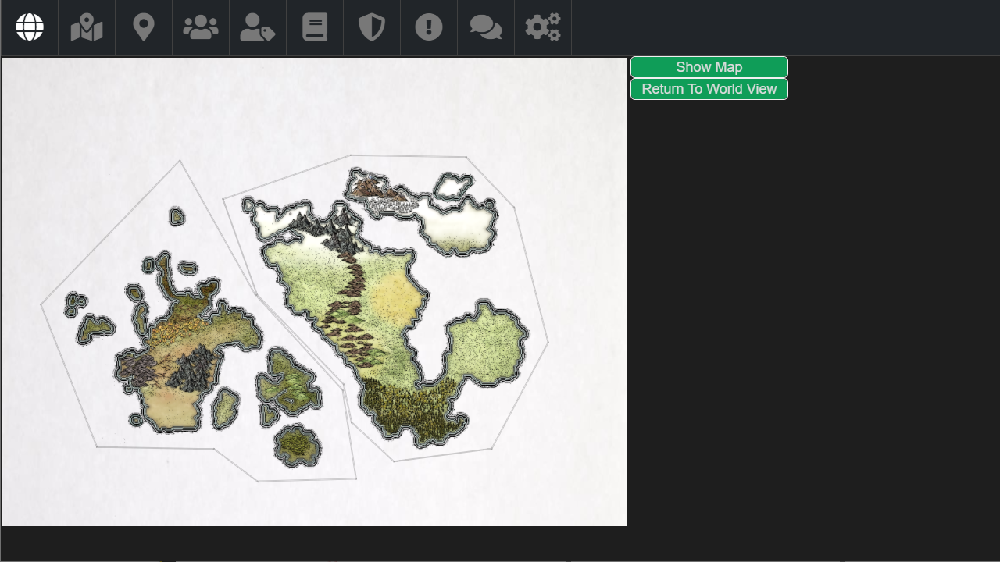
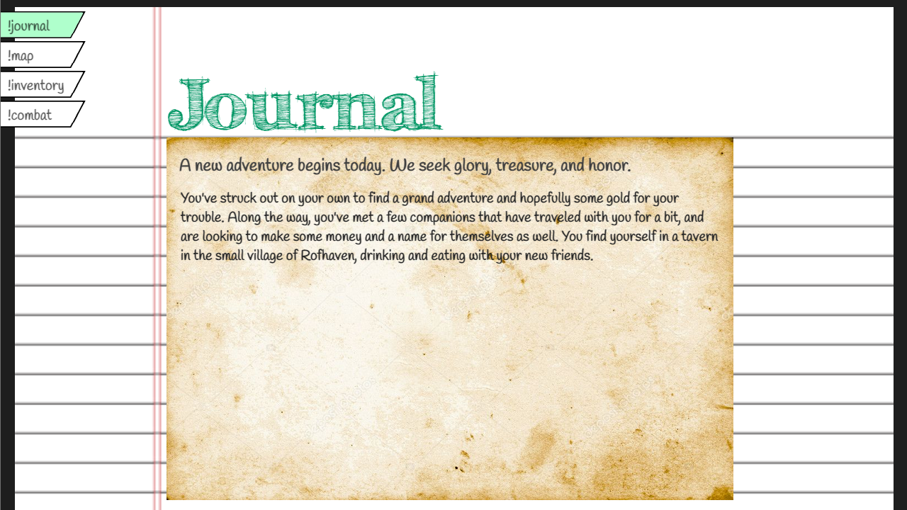

# [RPwMe](https://github.com/DrewBanyai/RPwMe) 
> RPwMe is a Twitch Chat integrated roleplay system for streamers and viewers to play together

[standard-image]: https://img.shields.io/badge/code%20style-standard-brightgreen.svg?style=flat-square
[standard-url]: http://standardjs.com/
[![standard][standard-image]][standard-url]

**Build 0.0.1**





This program is made to allow a streamer on Twitch to act as Game Master (GM) and play through a role-play game with users in chat. It utilizes a role-play system which is built-in and managed by the program in order to minimize the need for pre-planning campaign details. The tool creates a world and allows the GM to alter it to their liking, saving it for future use if desired. Players can join and contribute to the story and gameplay through chat commands, which create requests which the GM can approve or deny in cases where control is desired.

The program exists as a dual-window display, one window containing the Admin controls and one containing the Game display. The Game display is intended to be broadcast over Twitch while the Admin window is to remain hidden to everyone but the GM, allowing them to control the game from the background instead of showing their input and hidden information such as statistics, planned battles, hidden locations, secret notes/documentation, etc.

## Try it out

```
git clone https://github.com/DrewBanyai/RPwMe.git
cd RPwMe
npm install
~Setup settings.js with your channel and oauth information
npm start
```

## Build a release

```
git clone https://github.com/DrewBanyai/RPwMe.git
cd RPwMe
npm install
~Setup settings.js with your channel and oauth information
npm run publish
```

## Thanks

This demo utilizes information found in many areas, but I want to note a few specifically:
* [`electron-quick-start`](https://github.com/atom/electron-quick-start)
* [`electron multiple-windows example`](https://github.com/akabekobeko/examples-electron/tree/master/multiple-windows)
* [`tmi.js`](https://https://tmijs.com/)
* [`Code-a-Twitch-bot-using-NodeJS`](https://github.com/The-Assembly/Code-a-Twitch-bot-using-NodeJS)
* [`fontawesome-free`](https://www.npmjs.com/package/@fortawesome/fontawesome-free)

## License

[Apache License 2.0](LICENSE.md)